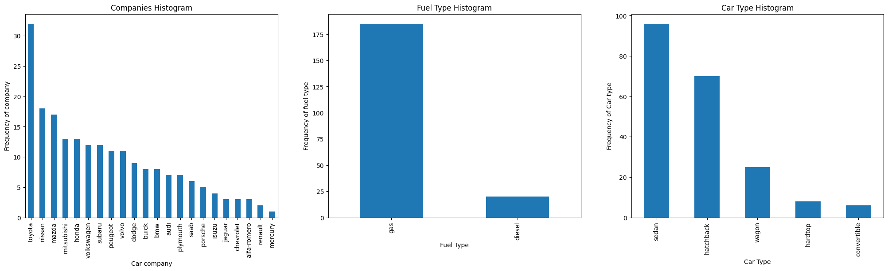
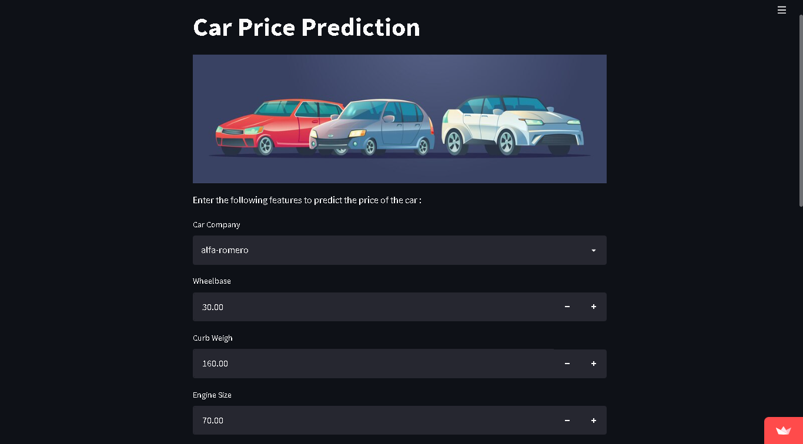

# Laporan Proyek Machine Learning
### Nama : Delvia Dianita Trianasari
### Nim : 211351039
### Kelas : Pagi A

## Domain Proyek

Pembelian mobil adalah salah satu keputusan finansial terbesar dalam kehidupan banyak individu.Orang-orang sering mencari informasi tentang harga mobil sebelum memutuskan untuk membeli.Harga mobil dapat bervariasi seiring waktu karena berbagai faktor,termasuk perubahan tren pasar,ketersediaan,permintaan,dan faktor ekonomi.Bagi penjual atau dealer,memiliki estimasi harga yang akurat dapat membantu dalam menentukan harga yang kompetitif. Kemajuan dalam analisis data dan machine learning telah membuka peluang untuk mengembangkan model,maka dari itu disini saya mengangkat proyek prediksi harga mobil karena dengan adanya proyek ini dapat membantu mempermudah masyarakat untuk mencari info tentang harga mobil,dengan dibuatnya proyek ini dapat mengurangi resiko kerugian yang dapat terjadi.
## Business Understanding

Proses klarifikasi masalah dalam proyek prediksi harga mobil adalah tahap awal yang sangat penting dalam pemahaman tujuan dan kebutuhan proyek.

Bagian laporan ini mencakup:

### Problem Statements

- Dalam era mobil yang semakin maju dan kompleks,pembeli dan penjual seringkali menghadapi kesulitan dalam menentukan harga yang wajar untuk kendaraan. Pernyataan masalah pertama adalah "Bagaimana kita dapat memprediksi harga mobil dengan akurat berdasarkan atribut kendaraan,sehingga dapat membantu pembeli dan penjual dalam mengambil keputusan?"
- Dalam dunia bisnis jual-beli mobil, transparansi harga adalah kunci. Pernyataan masalah kedua adalah, "Bagaimana kita dapat memberikan informasi yang jelas dan akurat tentang harga mobil kepada calon pembeli dan penjual, sehingga mereka dapat membuat keputusan yang cerdas?"
### Goals

- Mengembangkan model prediksi harga mobil yang memiliki akurasi tinggi berdasarkan atribut kendaraan.
- Memberikan layanan yang dapat membantu pemebeli dan penjual mobil dalam menentukan harga yang wajar.
- Meningkatkan transparansi dalam penentuan harga mobil.
- Memberikan platform atau alat yang dapat dengan mudah diakses oleh calon pembeli dan penjual untuk mendapatkan perkiraan harga yang akurat.
- Membantu mengurangi kesenjangan informasi dan negosiasi yang rumit dalam bisnis jual-beli mobil.

### Solution statements
- Menggunakan Feature Elimination(RFE) untuk mengidentifikasi fitur-fitur yang paling berpengaruh terhadap prediksi harga mobil. Hal ini akan membantu dalam mengurangi komplesitas model dan meningkatkan interprestasi.
- Model Regresi Linier akan dikembangkan dengan menggunakan data pelatihan. Model ini akan digunakan untuk memprediksi harga mobil berdasarkan fitur-fitur yang telah dipilih melalui RFE.
- Kinerja model akan dievaluasi menggunakan metrik evaluasi yang relevan, seperti RMSE (Root Mean Square Error), dan R-squared (R^2). Tujuan utama adalah untuk mencapai akurasi prediksi yang baik. 


## Data Understanding
Di dalam dataset "Car Data" berisi kumpulan data yang mengandung informasi tentang berbagai jenis mobil,termasuk atribut-atribut pembuatan seperti merek,model,spesifikasi teknis,dan harga jualnya. untuk jumlah atribut yang terdapat pada data ini yaitu berjumlah 26 tetapi disini saya hanya menggunakan 9 atribut yang terdiri dari "CarName,wheelbase,curbweight,enginesize,
boreratio,horsepower,carlength,carwidth,dan price".<br> 

[Car Data Dataset](https://www.kaggle.com/datasets/goyalshalini93/car-data/data)

### Variabel-variabel pada Car Data Dataset adalah sebagai berikut:
| No. | Nama Variabel | Tipe Data | Keterangan |
|-----|---------------|-----------|------------|
|  1. |CarName        |object     |Merupakan nama merek mobil untuk mengetahui informasi identifikasi tentang mobil-mobil dalam dataset.|
|  2.  |wheelbase     |float        |Merupakan indikasi tentang ukuran mobil.|
|  3.  |curbweight    |int        |Merupakan indikator dari berat mobil tanpa penumpang atau beban tambahan.|
|  4.  |enginesize    |int          |Merupakan kapasitas mesin mobil yang mengukur volume total dari semua silinder dalam mesin.|
|  5.  |boreratio     |float        |Merupakan variable yang mengacu pada rasio diameter lubang silinder terhadap panjang langkah(stroke) dalam mesin.|
|  6.  |horsepower    |int        |Merupakan ukuran tenaga mobil,untuk mengindikasikan data yang dihasilkan oleh mesin dan sering digunakan sebagai metrik performa.|
|  7.  |carlength     |float        |Merupakan panjang keseluruhan mobil dari depan hingga belakang mobil.|
|  8.  |carwidth      |float        |Merupakan ukuran lebar mobil.|
|  9.  |price         |int        |Merupakan nilai yang ingin diprediksi dalam proyek ini,yaitu harga mobil.|

**Visualisasi Data :**



## Data Preparation
-  **Mencari Dataset yang berisi informasi tentang data mobil**<br>
Kumpulan data yang mengandung informasi terkait dengan berbagai aspek mobil. Disini saya menggunakan dataset dari Kaggle [Car Data Dataset](https://www.kaggle.com/datasets/goyalshalini93/car-data/data).
- **Import Library dan Baca Data**<br>
```python
import numpy as np
import pandas as pd
import matplotlib.pyplot as plt
import seaborn as sns
from sklearn.model_selection import train_test_split
from sklearn import linear_model
from sklearn.metrics import mean_squared_error
```

```python
cars = pd.read_csv('car-data/CarPrice_Assignment.csv')
```
Data dari file CSV ("CarPrice_Assignment.csv") dibaca ke dalam DataFrame Pandas.

- **Penambahan Atribut "CompanyName" dan Normalisasi Merek Mobil**<br>
Membuat atribut baru "CompanyName" dengan mengambil nama merek mobil dari atribut "CarName" dengan menggunakan apply dan split.
Atribut "CarName" yang tidak diperlukan dihapus.
Melakukan normalisasi pada nama merek mobil dengan mengubahnya menjadi huruf kecil (lowercase) dan mengatasi kesalahan penulisan dengan menggunakan fungsi replace_name.
- **Handling Missing Data**<br>
Menghitung jumlah data yang hilang dalam dataset dengan menggunakan isnull().sum()
- **Visualisasi Data Harga Mobil**<br>
Melakukan visualisasi distribusi harga mobil dengan dua plot
Plot distribusi harga mobil menggunakan distplot dan Plot sebaran harga mobil menggunakan boxplot.
- **Visualisasi Data Fitur Lainnya**<br>
Melakukan visualisasi beberapa fitur lainnya seperti merek mobil, tipe bahan bakar, tipe mobil, tipe mesin, jumlah silinder, sistem bahan bakar, dan tipe penggerak.
- **Feature Engineering**<br>
Melakukan beberapa perubahan pada fitur, seperti menghitung "fueleconomy" dan melakukan binning (pembagian ke dalam kelompok) berdasarkan harga rata-rata merek mobil.
- **Menggunakan Teknik One-Hot Encoding**<br>
Menerapkan one-hot encoding pada beberapa fitur kategorikal untuk mengubahnya menjadi format yang dapat digunakan dalam pemodelan.
- **Pemisahan Data Train-Test**<br>
Memisahkan data menjadi data pelatihan dan data pengujian menggunakan train_test_split.
- **Pemodelan Regresi Linear**<br>
Melakukan pemodelan Regresi Linear pada data yang telah dipersiapkan.
Model Regresi Linear dilatih dan dievaluasi dengan menggunakan metrik R-squared (R^2) dan Root Mean Square Error (RMSE).
## Modeling<br>
Dalam tahap Modeling proyek prediksi harga mobil, saya akan menggunakan model Regresi Linier untuk memprediksi harga mobil. Regresi Linier adalah salah satu metode machine learning yang paling sederhana dan umum digunakan untuk masalah prediksi berdasarkan hubungan linier antara variabel independen dan variabel target.
```python
from sklearn import linear_model
lr = linear_model.LinearRegression()
```
```python
model = lr.fit(X_train, y_train)
```
```python
print ("R^2 is: \n", model.score(X_test, y_test))
```


## Evaluation
Dalam proyek prediksi harga mobil dengan menggunakan Regresi Linear, metrik evaluasi yang saya gunakan digunakan adalah Root Mean Square Error (RMSE) dan R-squared (R^2). <br>
 - **Root Mean Square Error (RMSE)**
 Dalam proyek ini, RMSE sebesar 0.0294 (atau sekitar 2.94%) menunjukkan bahwa model memiliki kesalahan rata-rata sekitar 2.94% dalam memprediksi harga mobil.<br>    
 ```python
 predictions = model.predict(X_test)
 print ('RMSE is: \n', mean_squared_error(y_test, predictions))
 ```
>***RMSE is:0.0438169291057123***

- **R-squared (R^2)**
Dalam proyek ini, R^2 sebesar 0.882, yang berarti model Anda mampu menjelaskan sekitar 88.2% dari variabilitas harga mobil. Ini menunjukkan bahwa model ini memiliki kemampuan yang baik dalam menjelaskan variasi dalam harga mobil.
Berdasarkan metrik evaluasi RMSE dan R^2, proyek ini memberikan hasil yang positif. Model Regresi Linear yang telah dikembangkan mampu memprediksi harga mobil dengan akurasi yang baik. RMSE yang rendah menunjukkan bahwa kesalahan prediksi model relatif kecil, sementara R^2 yang tinggi mengindikasikan bahwa model mampu menjelaskan sebagian besar variabilitas dalam harga mobil.
```python
lr = linear_model.LinearRegression()
model = lr.fit(X_train, y_train)  
print ("R^2 is: \n", model.score(X_test, y_test))
```
>***R^2 is:0.8242427962472653***<br>

Berdasarkan metrik evaluasi RMSE dan R^2, proyek ini memberikan hasil yang positif. Model Regresi Linear yang telah dikembangkan mampu memprediksi harga mobil dengan akurasi yang baik. RMSE yang rendah menunjukkan bahwa kesalahan prediksi model relatif kecil, sementara R^2 yang tinggi mengindikasikan bahwa model mampu menjelaskan sebagian besar variabilitas dalam harga mobil.


## Deployment
Car Price Prediction - https://car-price-prediction-2plczkifpumpah8cuja6mx.streamlit.app/


